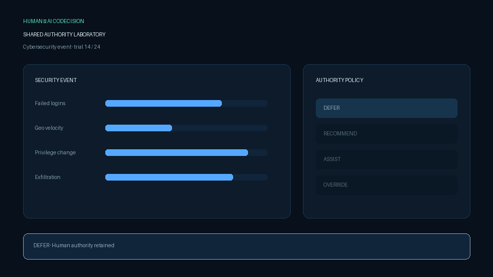

# Human-AI Codecision Systems

**When should AI defer, recommend, assist, or override a human decision?**

Human-AI Codecision Systems is an auditable research laboratory for uncertainty-aware shared authority. It operationalizes behavioral uncertainty, AI confidence, predicted risk, evolving trust, contestability, and collaborative utility in a simulated cybersecurity classification environment.



[Methods](docs/METHODS.md) · [Architecture](docs/ARCHITECTURE.md) · [Human study protocol](docs/HUMAN_STUDY.md) · [Ethics](docs/ETHICS.md) · [Evidence](docs/EVIDENCE.md) · [Roadmap](docs/ROADMAP.md) · [Baseline results](results/synthetic_baseline/README.md)

## Implemented conditions

| Policy | Authority behavior | Purpose |
|---|---|---|
| Human only | AI never influences the final choice | Unassisted control |
| Static recommendation | Uniform advice with no behavioral adaptation | Conventional decision-support control |
| Adaptive codecision | Escalation depends on inferred uncertainty, AI confidence, risk, disagreement, and trust | Proposed system |
| Aggressive automation | AI always controls the final choice unless contested | Over-automation stress test |

Every adaptive action includes a human-readable explanation and the exact threshold trace that activated it. Overrides are contestable. No names, emails, or demographic identifiers are collected by the default pilot interface.

## Run synthetic validation

```bash
python -m venv .venv
source .venv/bin/activate  # Windows: .venv\Scripts\activate
pip install -e ".[dev]"
python -m codecision.cli
```

Quick development run:

```bash
python -m codecision.cli --quick
```

Each evidence bundle contains trial telemetry, per-seed condition summaries, aggregate statistics with 95% confidence intervals, a reproducibility manifest, and generated charts.

## Launch the interactive study

```bash
python -m codecision.web
```

Open `http://127.0.0.1:5050`. The interface records response latency, cursor hesitation, answer revisions, confidence, intervention state, trust evolution, outcomes, and explanations. Participants can export their session or permanently delete it.

> Human-participant research must not begin as a formal study until institutional/IRB review, informed-consent language, recruitment criteria, data retention, and risk controls are approved. The interface is currently appropriate for local usability pilots—not publication claims about people.

## Evidence boundary

The checked-in baseline uses simulated human and AI agents. It validates software behavior, policy comparisons, logging, and analysis. It does **not** measure real human trust, satisfaction, workload, autonomy, or safety. Those outcomes require approved participant research.

## Development

```bash
ruff check .
pytest -q
python -m codecision.demo
```

CI tests Python 3.10 and 3.12 and uploads a fresh synthetic smoke-run evidence bundle.

## Citation and license

See [CITATION.cff](CITATION.cff). Code is available under the [MIT License](LICENSE).

