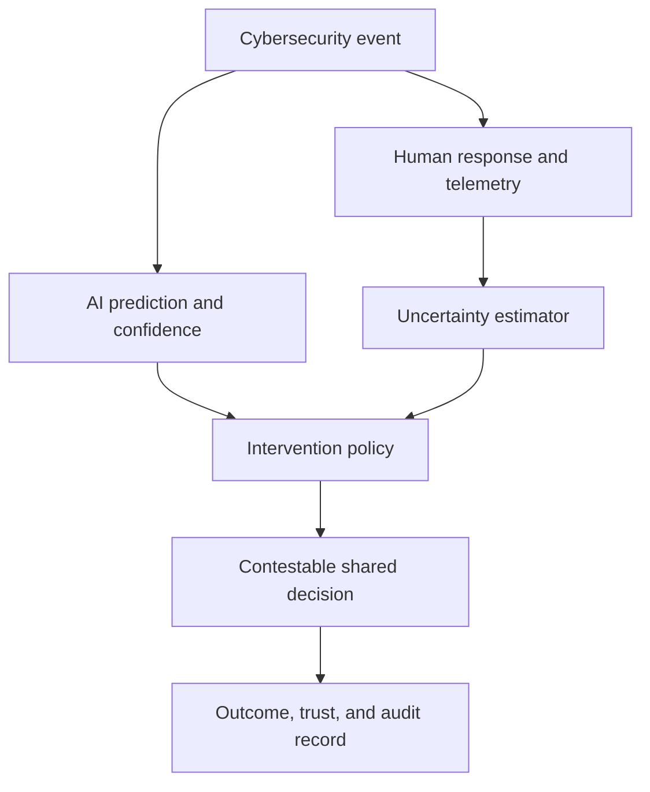

# Architecture

[← Home](../README.md) · [Methods](METHODS.md) · [Human study](HUMAN_STUDY.md)

| Module | Responsibility |
|---|---|
| `tasks.py` | reproducible cybersecurity events and hidden ground truth |
| `agents.py` | explicitly synthetic human and AI collaborators |
| `uncertainty.py` | inspectable behavioral uncertainty score |
| `policy.py` | defer/recommend/assist/override rules and threshold trace |
| `trust.py` | bounded asymmetric trust updates |
| `engine.py` | sequential authority allocation and audit records |
| `experiment.py` | multi-policy, multi-seed computational protocol |
| `metrics.py` | accuracy, reliance, calibration, autonomy, utility |
| `web.py` | consent-gated participant pilot API |
| `storage.py` | privacy-minimized local SQLite records and deletion |

