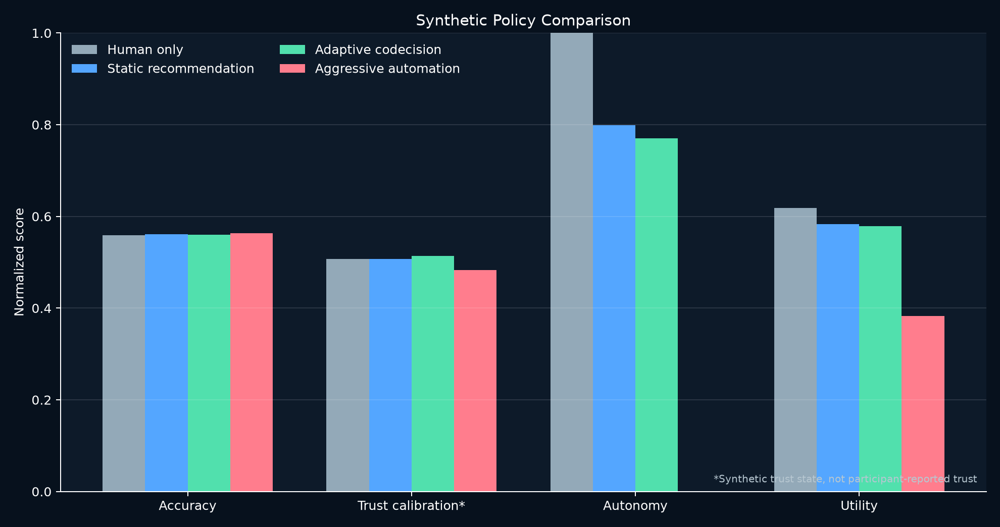
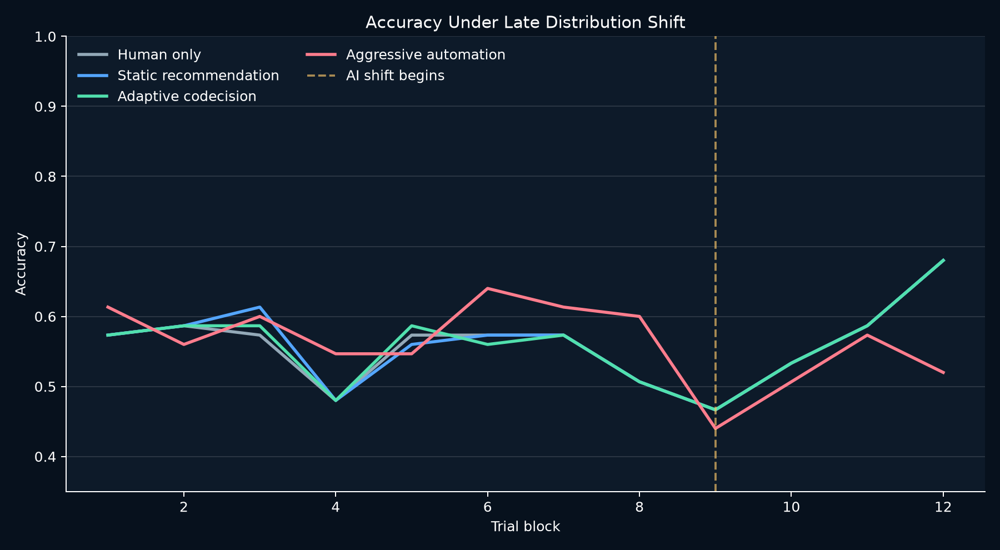
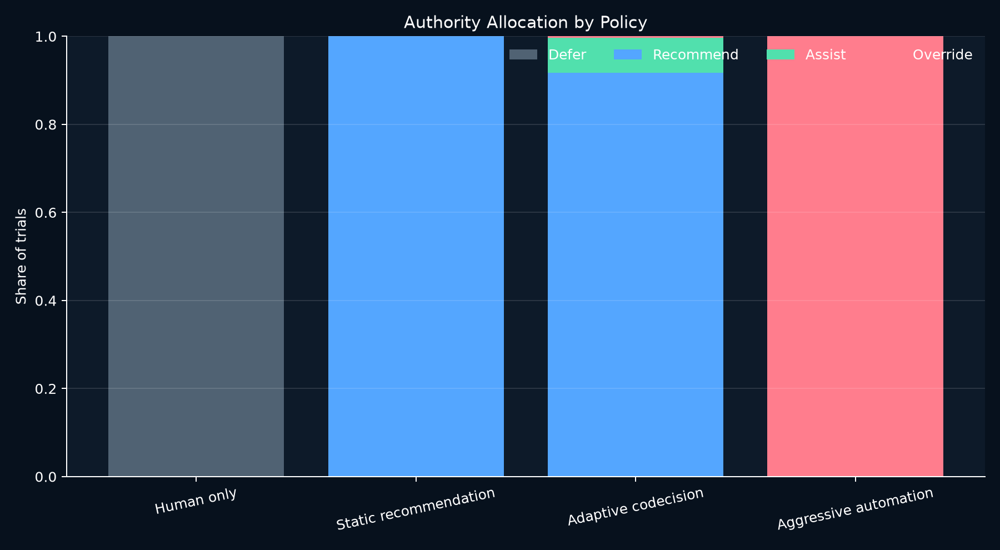

# Synthetic Stage One Baseline

[← Home](../../README.md) · [Methods](../../docs/METHODS.md) · [Evidence guide](../../docs/EVIDENCE.md)

This frozen bundle contains computational validation only: five independent seeds, 180 trials per policy and seed, 3,600 total decisions, and a controlled AI distribution shift during the final quarter of each run. There were **zero human participants**.

## Aggregate observations

Mean ± sample standard deviation across seeds:

| Policy | Accuracy | Escalation rate | Override rate | Unnecessary overrides | Autonomy | Utility |
|---|---:|---:|---:|---:|---:|---:|
| Human only | 0.5589 ± 0.0606 | 0.0000 | 0.0000 | 0.0000 | 1.0000 | 0.6186 ± 0.0253 |
| Static recommendation | 0.5611 ± 0.0580 | 0.0000 | 0.0000 | 0.0000 | 0.7990 | 0.5834 ± 0.0246 |
| Adaptive codecision | 0.5600 ± 0.0575 | 0.0822 ± 0.0182 | 0.0033 ± 0.0050 | 0.0011 ± 0.0025 | 0.7701 | 0.5787 ± 0.0268 |
| Aggressive automation | 0.5633 ± 0.0554 | 1.0000 | 1.0000 | 0.2111 ± 0.0283 | 0.0000 | 0.3824 ± 0.0296 |

## Interpretation

The adaptive policy successfully regulated authority: it escalated 8.2% of trials but overrode only 0.3%, with a 0.1% unnecessary-override rate. It did **not** improve synthetic accuracy or the declared utility score over the human-only control. Aggressive automation achieved a tiny accuracy increase while generating 21.1% unnecessary overrides, collapsing the synthetic trust state, eliminating autonomy, and producing the lowest utility.

The Stage One result therefore validates selective intervention behavior and rejects any present claim that the chosen adaptive thresholds improve outcomes. The next computational study should separate policy quality from agent quality through skill sweeps, threshold ablations, and held-out seeds. Human trust and satisfaction remain entirely unmeasured.

Audit the [aggregate summary](aggregate_summary.csv), [per-seed summaries](condition_summary.csv), [compressed trial telemetry](trial_telemetry.csv.gz), and [manifest](manifest.json). The gzip archive expands to a standard CSV.
